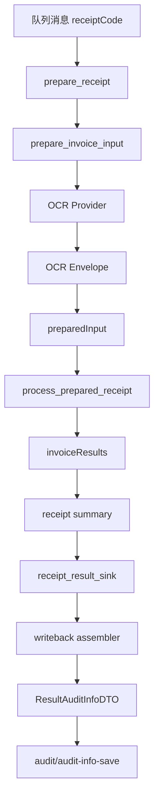

# Receipt Sink 与回写组装方案

## 1. 背景与目标

当前编排链路已经稳定拆成两阶段：

1. prepare_receipt：聚合单据级数据并拆成发票级 preparedInput
2. process_prepared_receipt：逐张发票执行 runtime 并产出 invoiceResults

后续回写接口 audit/audit-info-save 需要的字段很多，不能继续把回写逻辑散在 worker、runtime 调用层或调试脚本里。因此这里单独设计并实现一层 receipt sink / writeback assembler，用来完成：

1. 保留单据级和发票级完整上下文
2. 在整单处理完成后统一组装 ResultAuditInfoDTO
3. 将无法自动映射的字段显式保留，便于人工补充
4. 不把业务字段拼装逻辑下沉到 RabbitMQ worker

第一版范围已经明确：

1. 不直连数据库
2. 不本地伪造业务主键
3. 按整单一次性回调，不按单张发票提交
4. 隐藏明细表先按原始 JSON 透传

## 2. 当前架构边界

### 2.1 应用服务边界

application.py 继续作为唯一编排边界：

1. prepare_receipt 只负责准备数据
2. process_prepared_receipt 只负责逐张执行并汇总结果
3. 新增 receipt_result_sink，只在 summary 生成后触发一次
4. 保留原有 invoice_result_sink，继续支持逐张结果旁路处理

### 2.2 基础设施边界

rabbitmq_worker.py 继续保持瘦：

1. 取消息
2. 解析 receiptCode
3. 调 prepare_receipt
4. 调 process_prepared_receipt
5. 根据整单结果决定 ack / nack

worker 不承担任何回写 DTO 组装。

### 2.3 新增独立回写层

新增 writeback 组装层，职责是：

1. 从 prepared_receipt 和 processed_receipt 中提取回写源数据
2. 组装 ResultAuditInfoDTO 顶层对象
3. 把不明字段保留为空值或原始 JSON
4. 后续再接 callback client 调用真实接口

## 3. 端到端处理流程

## 4. OCR Envelope 方案

### 4.1 OCR Envelope 是什么

OCR envelope 是内部包装结构，不是外部接口。它的目的不是改变规则输入，而是把 OCR 的“规范结果”和“回写所需原始信息”一起保留下来。

如果只保留 normalized OCR 结果，会丢失这些关键数据：

1. 金蝶上传后的 fileDownUrl
2. recognitionCheck 原始 JSON
3. OCR 调用状态、错误信息、时间戳

这些数据分别是以下回写对象的直接来源：

1. auditRelationFiles
2. auditTruthCheckLogs
3. auditTruthCheckResultBills / Items / ItemCols

### 4.2 OCR Envelope 推荐结构

| 字段 | 说明 | 用途 |
| --- | --- | --- |
| provider | OCR 厂商标识，当前固定 kingdee | 调试与路由 |
| request.receiptCode | 当前核销单号 | 回写关联 |
| request.fileName | 当前文件名 | 回写与调试 |
| request.filePath | 当前识别输入路径 | 调试 |
| upload.fileType | 上传时推断的文件类型 | 调试 |
| upload.fileDownUrl | 金蝶上传返回地址 | auditRelationFiles |
| recognition.rawPayload | recognitionCheck 原始响应 JSON | auditTruthCheckLogs 与隐藏明细透传 |
| recognition.normalized | 当前规则引擎继续使用的 OCR 标准字段 | preparedInput |
| status.code | OCR 状态码 | auditTruthCheckLogs.status |
| status.message | OCR 成功/失败消息 | auditTruthCheckLogs.msg |
| status.startedAt | OCR 开始时间 | 可观测性 |
| status.finishedAt | OCR 结束时间 | createTime / 可观测性 |
| error | 失败时的异常信息 | 后续补偿 |

### 4.3 OCR Envelope 的实现规则

1. core.py 负责兼容两种 OCR provider 返回：普通 OCR dict 和 envelope
2. 如果 provider 返回 envelope，则 build_rule_input 只消费 recognition.normalized
3. envelope 本体保存在 preparedInput.serviceData.ocrEnvelope 中，供 writeback assembler 使用
4. envelope 不保存 token、密钥等敏感信息

## 5. 当前已实现内容

截至当前版本，已经落地了第一批实现：

1. application.py 已新增 receipt_result_sink，并在整单 summary 生成后回调一次
2. bootstrap.py 已支持透传 receipt_result_sink
3. core.py 已支持 OCR envelope 兼容拆包
4. kingdee_ocr.py 已开始产出 OCR envelope，而不是只返回 normalized OCR dict
5. 新增 expense_audit_orchestrator/writeback.py，提供 assemble_result_audit_info 骨架

这意味着当前已经具备：

1. 整单级回写挂点
2. OCR 原始上下文保留能力
3. 最小可用的回写 payload 组装器
4. `expense_audit_orchestrator.writeback_client` 已提供真实 callback client，可 POST 到 `audit/audit-info-save`
5. `rabbitmq_worker.py` 默认主链路已开启真实回写；`prepare_from_queue.py` 仍只用于调试导出，不发起真实回调
6. 回写组装阶段会为 `auditInvoiceFiles.aifid` 和 `auditInvoiceInfoContents.aiicid` 生成 UUID，并将 `auditInvoiceFiles.type` 固定为 `1`
7. `rabbitmq_worker.py` 现支持 `--prepared-output-dir` 和 `--writeback-output-dir`，可在主链路联调时把 prepared receipt 与 writeback payload 分别落盘；writeback payload 会先导出，再发真实回调

## 6. 字段来源映射总表

### 6.1 ResultAuditInfoDTO 顶层字段

| 目标字段 | 主要来源 | 回退/保留策略 | 状态 |
| --- | --- | --- | --- |
| instanceCode | auditInfo.instanceCode | receiptCode | 已映射 |
| isEor | — | 不属于当前 `ResultAuditInfoDTO` 顶层字段；仅从 `auditInfo.isEor` 读取并用于流程图/E31 判断，不发送到 `audit-info-save` | 不回写 |
| auditLogs | invoiceResults + decisionOutput | 缺失字段保留空值 | 已初步实现 |
| auditInvoiceInfos | invoiceInfo + normalized OCR + currentAuditInvoiceFile | 无法确认的字段保留 | 已初步实现 |
| auditInvoiceFiles | serviceData.auditInvoiceFiles | 无则空数组 | 已映射 |
| auditRelationFiles | currentAuditInvoiceFile + ocrEnvelope.upload.fileDownUrl | 无 fileDownUrl 保留空值 | 已初步实现 |
| auditInvoiceInfoContents | normalized OCR.items | 无则空数组 | 已初步实现 |
| auditTravels | 预留 | 先空数组 | 保留待补 |
| formInvoiceTaxViews | 预留 | 先空数组 | 保留待补 |
| auditTruthCheckLogs | ocrEnvelope.recognition.rawPayload + ocrEnvelope.status | 无 envelope 无法组装 | 已初步实现 |
| auditTruthCheckResultBills | rawPayload 原样透传 | 无则空数组 | 已初步实现 |
| auditTruthCheckResultItems | rawPayload 原样透传 | 无则空数组 | 已初步实现 |
| auditTruthCheckResultItemCols | rawPayload 原样透传 | 无则空数组 | 已初步实现 |

## 7. 详细字段来源映射

### 7.1 audit_log

| 字段 | 主要来源 | 回退/保留策略 |
| --- | --- | --- |
| instanceCode | auditInfo.instanceCode | receiptCode |
| invoiceFileId | currentAuditInvoiceFile.afiid | 缺失保留 |
| invoiceInfoId | invoiceInfo.aiiid | 缺失保留 |
| reasonCode | decisionOutput.reasonCode | 保留待人工补 |
| auditType | decisionOutput.auditType | 保留待人工补 |
| auditContent | decisionOutput.auditContent | 保留待人工补 |
| distinguishContent | decisionOutput.distinguishContent | 保留待人工补 |
| distinguishResult | invoiceResult.decisionStatus | execution 失败时可写 failed |
| message | decisionOutput.message 或 errorMessage | 无则空值 |

### 7.2 audit_truthcheck_log

| 字段 | 主要来源 | 回退/保留策略 |
| --- | --- | --- |
| miInstanceCode | auditInfo.instanceCode | receiptCode |
| json | ocrEnvelope.recognition.rawPayload | 无 envelope 则无法映射 |
| status | ocrEnvelope.status.code | 无则保留 |
| msg | ocrEnvelope.status.message | 无则保留 |
| createTime | ocrEnvelope.status.finishedAt | 无则保留 |

### 7.3 AuditRelationFile

| 字段 | 主要来源 | 回退/保留策略 |
| --- | --- | --- |
| fileId | currentAuditInvoiceFile.fid | 缺失保留 |
| fileName | currentAuditInvoiceFile.fileName | 回退 request.fileName |
| manufacturer | 固定 piao-zone | 无 |
| manufacturerFileId | ocrEnvelope.upload.fileDownUrl | 缺失保留 |
| manufacturerFileDownloadUrl | ocrEnvelope.upload.fileDownUrl | 缺失保留 |
| status | 固定 TRUE | 无 |
| createBy | 预留 | 保留 |
| createTime | currentAuditInvoiceFile.createTime 或 ocrEnvelope.status.finishedAt | 缺失保留 |
| updateBy | 预留 | 保留 |
| updateTime | ocrEnvelope.status.finishedAt | 缺失保留 |

### 7.4 audit_invoiceinfo

| 字段 | 主要来源 | 回退/保留策略 |
| --- | --- | --- |
| aiiid | invoiceInfo.aiiid | 不本地生成 |
| miInstanceCode | auditInfo.instanceCode | receiptCode |
| createTime | invoiceInfo.createTime | 回退 currentAuditInvoiceFile.createTime |
| miApplyUserId | invoiceInfo.miApplyUserId | 回退 auditInfo.verifiUserId |
| miApplyUserName | invoiceInfo.miApplyUserName | 回退 auditInfo.verifiUserName |
| billTypeCode | 预留 | 保留待人工补 |
| accountingCode | normalized OCR.accountingCode | 回退 auditInfo.accountingCode / companyList.cCode |
| chequeNo | normalized OCR.chequeNo / invoiceNo / serialNo | 缺失保留 |
| issueDate | normalized OCR.invoiceDate | 回退 billCreateTime |
| estimatedTotalAmount | normalized OCR.totalAmount / amount / invoiceAmount | 缺失保留 |
| payingCorp | normalized OCR.buyerName / orgName | 回退 auditInfo.verifiUserCompanyName |
| payerBankCode | normalized OCR.buyerAccount | 保留待补 |
| payerActName | normalized OCR.buyerAddressPhone | 保留待补 |
| payerAct | normalized OCR.buyerTaxNo | 缺失保留 |
| drawingCorp | normalized OCR.salerName | 缺失保留 |
| receActName | normalized OCR.salerTaxNo | 缺失保留 |
| receAct | normalized OCR.salerAddressPhone | 缺失保留 |
| sealNo | normalized OCR.companySeal | 保留待补 |
| receBankCode | normalized OCR.salerAccount | 缺失保留 |
| taxRate | normalized OCR.items[0].taxRate | 缺失保留 |
| totalTax | normalized OCR.totalTaxAmount / taxAmount | 缺失保留 |
| summary | normalized OCR.remark | 缺失保留 |
| orderDate | normalized OCR.orderDate | 保留待补 |
| priorEndorsee | normalized OCR.priorEndorsee | 保留待补 |
| costClasses | normalized OCR.costClasses | 保留待补 |
| electronicBillNo | normalized OCR.electronicBillNo | 保留待补 |
| post | normalized OCR.post | 保留待补 |
| departure | normalized OCR.departure | 保留待补 |
| reasonStatus | executionStatus 成功映射为 1，否则 0 | 后续可细化 |
| reasonCode | decisionOutput.reasonCode | 保留待人工补 |
| fid | currentAuditInvoiceFile.fid | 缺失保留 |
| parentFid | currentAuditInvoiceFile.fid | 缺失保留 |
| billTypeFullName | 预留 | 保留待人工补 |
| atcrid | 预留 | 保留待人工补 |
| enable | 固定 TRUE | 无 |
| aiid | currentAuditInvoiceFile.aiid | 缺失保留 |

### 7.5 audit_invoiceinfo_content

| 字段 | 主要来源 | 回退/保留策略 |
| --- | --- | --- |
| aiicid | 组装阶段生成 UUID | 不再依赖上游 |
| aiiid | auditInvoiceInfo.aiiid | 缺失保留 |
| miInstanceCode | auditInfo.instanceCode | receiptCode |
| standard | item.specModel | 缺失保留 |
| unit | item.unit | 缺失保留 |
| quantity | item.num | 缺失保留 |
| unitprice | item.unitPrice | 缺失保留 |
| content | item.goodsName | 缺失保留 |
| taxRate | item.taxRate | 缺失保留 |
| amount | item.detailAmount | 缺失保留 |
| taxAmount | item.taxAmount | 缺失保留 |
| createTime | ocrEnvelope.status.finishedAt | 缺失保留 |
| atcrId | 预留 | 保留待补 |
| compliance | goodsName 不包含违约金/代收费时为 TRUE | 无 goodsName 时默认 TRUE |

## 8. 不可映射字段处理规则

第一版统一遵循以下原则：

1. 不猜字段语义
2. 不伪造业务主键
3. 保留空值、空数组或原始 JSON
4. 需要后续人工补的字段在文档里显式标出来

当前明确需要人工补口径或等待上游定义的字段主要包括：

1. audit_log.reasonCode
2. audit_log.auditType
3. audit_log.auditContent
4. audit_log.distinguishContent
5. audit_invoiceinfo.billTypeCode
6. audit_invoiceinfo.billTypeFullName
7. audit_invoiceinfo.atcrid
8. audit_invoiceinfo_content.aiicid
9. audit_invoiceinfo_content.atcrId
10. 审批人、创建人、更新人等流程字段

## 9. 已落地代码与文件位置

当前相关实现与文档位置如下：

1. [expense_audit_orchestrator/application.py](../expense_audit_orchestrator/application.py)：新增 receipt_result_sink
2. [expense_audit_orchestrator/bootstrap.py](../expense_audit_orchestrator/bootstrap.py)：透传 receipt_result_sink
3. [expense_audit_orchestrator/core.py](../expense_audit_orchestrator/core.py)：兼容 OCR envelope，保留 ocrEnvelope 到 serviceData
4. [expense_audit_orchestrator/kingdee_ocr.py](../expense_audit_orchestrator/kingdee_ocr.py)：开始产出 envelope
5. [expense_audit_orchestrator/writeback.py](../expense_audit_orchestrator/writeback.py)：新增 assemble_result_audit_info 骨架
6. [回写数据库.md](../回写数据库.md)：回写字段定义来源
7. [docs/plan.md](plan.md)：编排边界设计

## 10. 下一步实施建议

下一轮建议按这个顺序继续：

1. 在 writeback.py 中继续补 auditTravels、formInvoiceTaxViews 和隐藏明细表细分 mapper
2. 补齐回调失败语义：是否整体失败、是否保留重试数据、是否输出 payload 文件
3. 评估是否需要为重复回写场景补幂等更新或跳过策略
4. 增加 prepare_from_queue.py 的 payload 导出调试模式
